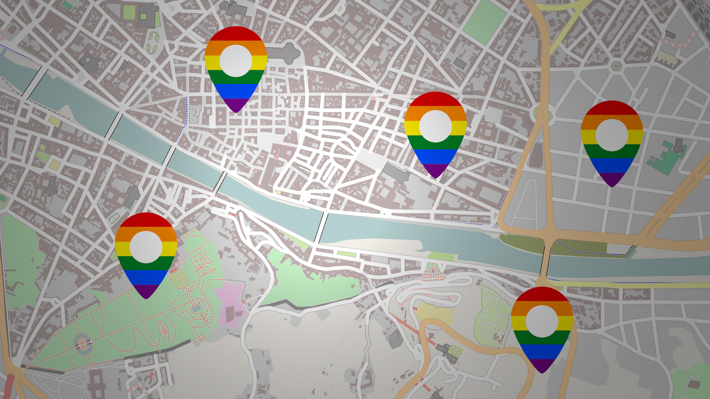

<!-- --- 
class: hide-navbar 
--- -->

<titulo>LGBTQ+ Connect</titulo>

> Um plugin para WordPress projetado para simplificar o mapeamento georreferenciado de empreendimentos e serviços voltados para a comunidade LGBTQIAP+.

- BRISA
- FGA/UnB

[Documentação](README.md)
[GitHub](https://github.com/ResidenciaTICBrisa/T2G8-Plugin-Wordpress)
<!-- [Google](github.com) -->

