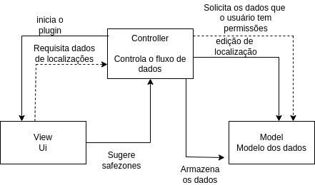

# Decisão Arquitetônica - Divisão da Arquitetura em Frontend e Backend

## Problema
A necessidade de organizar a arquitetura do plugin de forma a separar claramente as responsabilidades entre a camada de apresentação (frontend) e a camada de lógica e dados (backend).

## Decisão
Dividir a arquitetura do plugin em frontend e backend, utilizando PHP como lógica de negócios no backend devido à necessidade do WordPress e HTML, CSS e JavaScript para o frontend.

## Status
Decidida

## Grupo
Arquitetura

## Suposições
- A equipe possui conhecimento e habilidades para implementar e manter a arquitetura proposta.

## Restrições
- O frontend e o backend devem se comunicar de forma eficiente e segura.
- O uso de PHP e SQL para backend está em conformidade com os padrões tecnológicos aceitos pela organização.

## Posições Consideradas
- Dividir a arquitetura em frontend e backend para separar claramente as responsabilidades e facilitar a manutenção e evolução do plugin.

## Argumento
A divisão da arquitetura em frontend e backend permite uma melhor organização do código, facilitando a manutenção e a evolução do plugin. O uso de PHP e SQL é uma escolha sólida para garantir a eficiência e a segurança das operações do plugin.

## Implicações
- A equipe precisará gerenciar dois conjuntos de código (frontend e backend), o que pode aumentar a complexidade do projeto.

## Decisões Relacionadas
- Decisões relacionadas à escolha de tecnologias específicas para o frontend e backend.
- Decisões relacionadas à arquitetura de comunicação entre o frontend e backend.

## Requisitos Relacionados
- Requisitos de desempenho para garantir que a comunicação entre o frontend e backend seja rápida e eficiente.
- Requisitos de segurança para proteger os dados transmitidos entre o frontend e backend.

## Artefatos Relacionados
- Documentos de design de interface do usuário para o frontend.
- Documentos de modelagem de dados para o backend.

## Princípios Relacionados
- Princípios de separação de responsabilidades para garantir que cada camada da arquitetura tenha uma função clara e específica.

