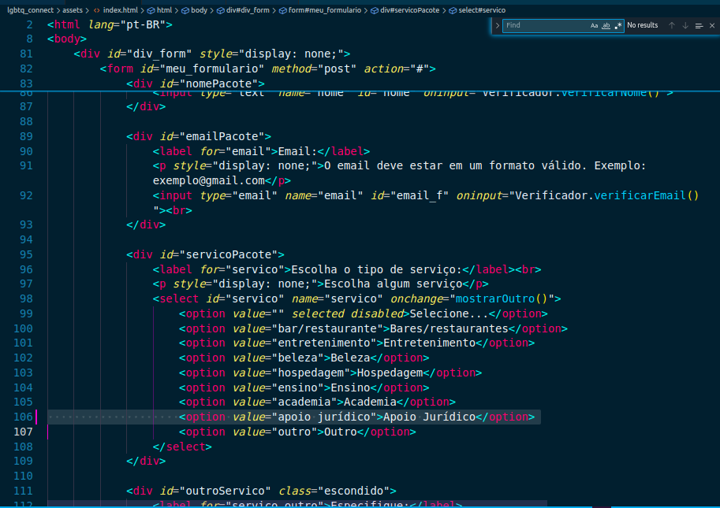
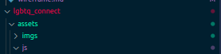
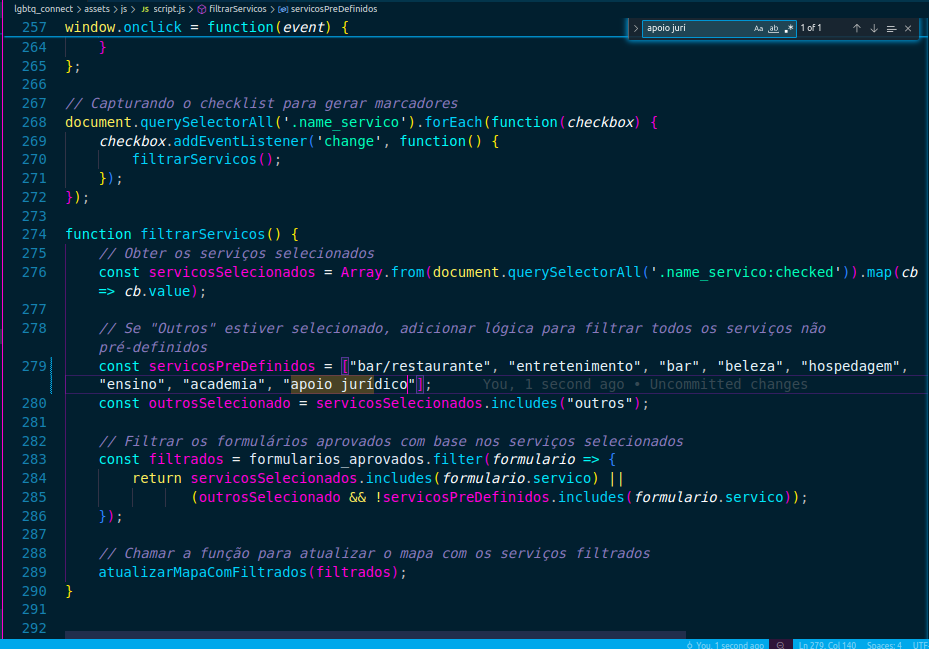
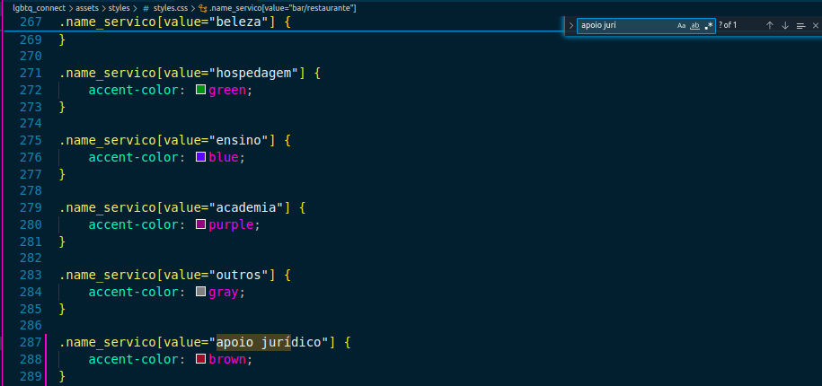
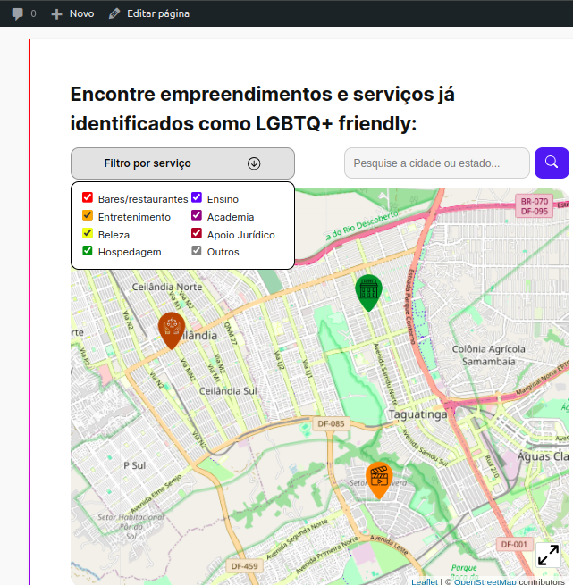

# Adicionando Novos Tipos de Serviço e Marcadores Personalizados
## Introdução
Para garantir a escalabilidade e a flexibilidade do plugin "LGBTQ+ Connect", é importante que novos tipos de serviço possam ser adicionados facilmente, com marcadores personalizados para representar esses serviços no mapa. Este tutorial orientará você, em nível de código, sobre como realizar essa implementação.

## Passos para Adicionar Novos Tipos de Serviço
### 1. Adicionando um Novo Tipo de Serviço no Formulário
Primeiramente, é necessário garantir que o novo tipo de serviço seja armazenado corretamente na tabela do banco de dados. A tabela que armazena os tipos de serviço é referenciada pela coluna "servico".
Se você deseja adicionar um novo serviço certifique-se de que ele seja inserido na tabela correspondente, no nosso exemplo vamos adicionar um serviço chamado "Apoio Jurídico".

- <b>1.1 - Comece primeiro selecionando uma imagem para servir como marcador, recomendamos usar o mesmo modelo de marcadores que já estão no plugin e mudando apenas a cor dele e o ícone no meio do marcador para identificação do tipo de serviço </b>

  

- <b>1.2 - Agora você irá acessar o arquivo "index.html" e ir até a div "servicoPacote" </b>
 

  

- <b>1.3 - Adicione o tipo de serviço como uma option onde o valor é o nome do tipo de serviço em minúsculo, no nosso caso será apoio jurídico</b>

  

- <b>1.4 - Com isso já teremos o novo tipo de serviço aparecendo no seu plugin e sendo adicionado ao banco de dados quando ele for selecionado </b>

  

### 2. Associando Imagens Personalizadas aos Novos Serviços
Para que um novo tipo de serviço tenha um marcador personalizado no mapa, você precisará associar uma imagem ao serviço recém-criado. Isso é feito diretamente na lógica que define os marcadores no JavaScript.

-<b>2.1 - Adicione a imagem dentro da pasta imgs dentro da pasta assets do plugin </b>

  

- <b>2.2 - Vá até index.php e encontre o array "$marcadores" que está na função "enfileirar_scripts"</b>

  

- <b>2.3 - Você irá adicionar dentro do array "$marcadores" o valor com o nome do seu novo tipo de serviço e linkar ele diretamente com a imagem que foi feita para representa-lo</b>

  

- <b>2.4 - Repita esse mesmo processo no array "$marcadores" na função "enfileirar_scripts_admin</b>

  

- <b>2.5 - Com isso temos o marcador já aparecendo juntamente dos marcadores antigos</b>

  

### 3. Adicionano o novo tipo de serviço ao filtro
Com o novo tipo de serviço adicionado e sua imagem definida e também adicionada só precisamos agora adicionar o novo tipo de serviço ao filtro para que você possa filtrar apenas aquele tipo de serviço se for necessário

-<b>3.1 - Acessa o arquivo script.js e vá até a função "filtrarservicos":</b>

  

-<b>3.2 - Adicione na constante "servicosPreDefinidos" o novo tipo de serviço com o mesmo valor que adicionamos no passo 1.3</b>

  

-<b>3.3 - Agora vá até o arquivo styles.css que está na pasta styles do plugin</b>

  

-<b>3.4 - Defina um novo ".name_servico" com o mesmo valor do passo 1.3 e defina um accent-color com a cor desejada</b>

  

-<b>3.5 - Com isso temos o novo tipo de serviço colocado separadamente dentro do filtro por tipo de serviço <b>

  

